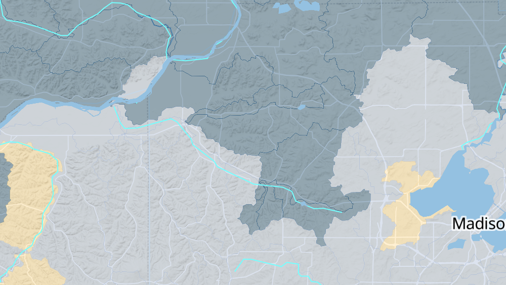

# Makerspace Journal
An informal documentation of the Makerspace journey of discovery.

## Recent Additions
<RecentArticles/>

## How to use
* Fork the repository
* Clone your fork
* Make the canonical master branch your 'upstream' remote
* Add your new document to the 'posts' folder
* Make a pull request to the canonical master branch

### Get Started with the Journal
To start adding to the Makerspace Journal, the first thing you need to do is 'fork' the repository. Then clone your fork
to your local machine and set the canonical master branch as a remote connection named 'upstream'. 

This is the basic code.
```
Assuming you have 'forked' the 'journal-vuepress' repository . . .
git clone https://github.com/<yourUserName>/journal-vuepress.git
cd journal-vuepress
git remote -v 
// The line above will list the connection to the remote git repository
// This should be your fork. It will be called 'origin' and have a 'push' and 'fetch' associated with it.
git remote add upstream https://github.com/usgs-makerspace/journal-vuepress.git 
// The above line will create a remote connection that you have named 'upstream'.  
// This is a connection to the canonical repository and will let you pull the newest code from there.
git remote -v
// The line above should now have four connections, two called 'origin' and two called 'upstream'
```
With the basics out of the way, you are ready to start you first journal entry. In a code editor with the capacity to edit
'Markdown' files ('.md'), open a text file an name it your_journal_entry.md. Replacing the 'your_journal_entry' 
with something much cooler and more on topic. If your code editor stinks at editing 'Markdown' files there are many online 
editors available. Just do a search for 'online markdown editor' and you will find something that will work for you. You
can edit your journal entry there, and paste it back into the code.

#### What makes a good Journal entry?
1 - Did you just complete a task that seemed simple at first but turned out to have a bunch of pit falls and traps that made completeing it a 
huge pain in the arse? If so, save your fellow team members the pain of having to learn those hard lessons all over again
and add your knowledge here. Your teammates will thank you.

2 -  Did you do a research task? If so, the world wants to know your results. To document research tasks follow this pattern (currently in beta, 
please feel free to improve the pattern) 
```
Research Task Check List
1 - State when you did the task
2 - State why you did the task
3 - State what you did
4 - State your conclusion/results/recommendations 
```
#### Inserting images
The big downside to using markdown for a journal is that adding images require more than cutting and pasting - boo.
To  get an image into the Journal first add the image to the project in the folder called 'markDownImages'.
Then add a link to the image you want displayed using the following pattern.
```
// A general example for adding an image link.


// A specific example . . .

```

Here is the above link in action.

