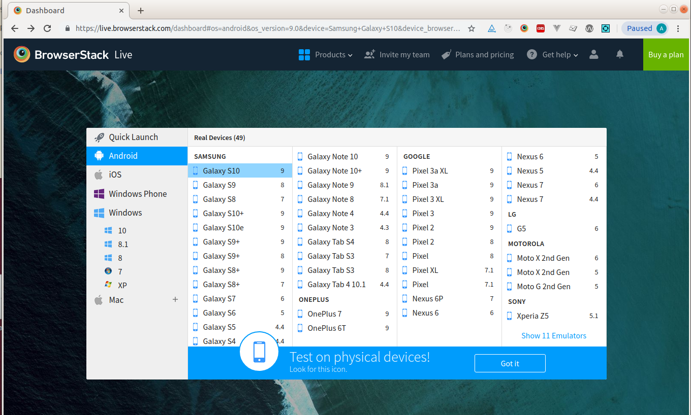
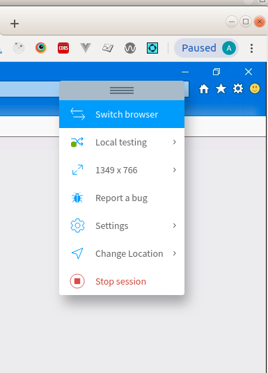

# Browserstack for Vue Application Local Test

According to the Browserstack website 'Browserstack loves open source'. Which is good for us, since the folks a Browserstack
off one year licenses for five users for free! 

So how do we get started? Step on is respond to the invitation and follow the instructions to set up your account.
Once your account is set up, you can go to Browserstack.com and get to work. 

The first thing that you will, probably, need to do, is set up local testing with Browserstack 'Live'. You can
find a link to information about setting up local testing on the Browserstack main page in the top navigation bar
under the listing 'Get help'. 

Image - Browserstack main page (this is what the page will look like once you have Browserstack 'Live' running. Whether 
Browserstack 'Live' is running or not, you should see the 'Get help' option in the navigation bar. )


In the 'Get help' menu, select 'local testing'. This will open an new page where you will want to choose 'LIVE'. You will
then find yourself on a page will all sorts of information on local testing with Browserstack 'Live'. 

To get started you will need to download the 'BrowserstackLocal' application. To do this, you will need to 
select your operating system and desired browser from the drop down list Browserstack provides. I suggest using your Virtual Machine to run BrowserstackLocal, since 
our organizations security settings will block most things we want to use on Windows machines. 

You may need to provide an access key while setting up BrowserstackLocal. If you do, and you don't know your key, like me,
you can get a new one here, https://www.browserstack.com/automate/reset-access-key . If you are signed in, Browserstack will
automatically populate the needed 'curl' command with your information. If you are not prompted for a key, great.

Now you are almost ready to start testing. If you head back to the Browserstack main page you should see a list of 
browsers that you can run your local application on. 

Browserstack allows you to test by directly connecting to your 'localhost'. UNFORTUNATLY, this does not seem to work on the 
DOI network. So rather that dig deeper into the headache inducing topic, I'll skip to something that actually mostly 
works. 

## Attach Browserstack to a Local Directory
Another option open to Browserstack is to allow it to run the 'dist' directory of your Vue application. First things first,
you will need to 'build' your Vue application, so that you have a 'dist' folder for Browserstack to run. This is typically done
by running  . . .
```
npm run build-test or whatever build type you choose, like npm run build-beta

please note - that Browserstack will not be able to call on interal resources, so on a project like WBEEP
using the 'test' build will cause requests to sources interal to the USGS for the HRUs so these will not
show when the map is rendered.
``` 
Now that you have a new copy of your application all ready to run, all you need to do is tell Browserstack where 
to find it. Here is the cheat sheet version of those steps.
```
1 - From the main page, select the browser from the list on which you wish to test
2 - Once browser is loaded, go to the floating Browserstack options box
3 - Click 'local testing'
4 - Under 'Folder Testing' click 'Select Folder' and follow the prompts to select your 'dist' folder in your Vue application
```  


Summary, this should be enough to test a Vue application on the multitude of browsers offered by Browserstack.
This is not a perfect solution by any means, as we are hampered by our organizations broad security polices,
 but it is the best we have at the moment. 
 
 Just remember, to see any changes, you will need to 'build' not 'serve'
 the Vue application so that Vue places a new copy of the application into the 'dist' folder.